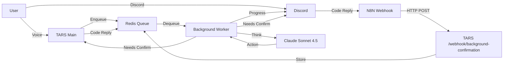

# Background Programming Tasks

**Autonomous coding sessions that run for up to 15 minutes while TARS stays responsive**

---

## Overview

Background programming allows TARS to work on complex coding tasks autonomously while you:
- Continue having conversations with TARS
- Ask about other topics (weather, news, etc.)
- Set reminders or manage contacts
- Check progress on the background task anytime

**How it works**: When you ask TARS to "build a calculator app with tests", instead of blocking for 15 minutes, TARS:
1. Starts a background worker task
2. Immediately responds: "Started task #abc123, I'll update you on Discord"
3. Remains fully responsive to your other requests
4. The background worker iterates through code/test/fix loops using Claude Sonnet 4.5
5. Sends progress updates to Discord in real-time
6. If a destructive command needs confirmation, asks you via BOTH Discord and voice (if in call)

---

## Architecture



**Key Components**:
- **Redis Queue (RQ)**: Manages background tasks, survives TARS restarts
- **Worker Process**: Separate Python process that executes coding tasks
- **Claude Sonnet 4.5**: The "brain" that plans, codes, tests, and fixes
- **KIPP Integration**: Routes all Discord updates through the main N8N webhook
- **Dual-Channel Confirmation**: Requests via Discord AND voice (if you're in a call)

---

## Setup

### 1. Install Redis

**macOS**:
```bash
brew install redis
brew services start redis

# Verify
redis-cli ping  # Should respond: PONG
```

**Ubuntu/Debian**:
```bash
sudo apt update
sudo apt install redis-server
sudo systemctl start redis
sudo systemctl enable redis  # Start on boot

# Verify
redis-cli ping  # Should respond: PONG
```

**Docker** (if you prefer containers):
```bash
docker run -d -p 6379:6379 --name redis redis:latest
```

### 2. Install Dependencies

```bash
pip install -r requirements.txt
```

This includes: `rq>=1.15.0` and `redis>=5.0.0`

### 3. Configure Environment

Add to your `.env` file:

```env
# KIPP Configuration (for Discord updates)
N8N_WEBHOOK_URL=https://n8n.srv1283735.hstgr.cloud/webhook-test/your-webhook-id

# Redis Configuration
REDIS_HOST=localhost
REDIS_PORT=6379
REDIS_DB=0

# Background Task Settings
MAX_TASK_RUNTIME_MINUTES=15
ENABLE_DETAILED_UPDATES=true  # false = only major phase updates

# Discord Updates (routed through KIPP - same N8N webhook)
# No separate DISCORD_UPDATES_WEBHOOK needed!
```

### 4. Set Up N8N Discord Integration

See [N8N_BACKGROUND_TASKS_SETUP.md](N8N_BACKGROUND_TASKS_SETUP.md) for detailed N8N workflow configuration.

**Quick summary**: N8N needs to:
- Receive webhook from TARS with task updates
- Send formatted messages to Discord
- Listen for confirmation code replies
- POST confirmation codes back to TARS

### 5. Start the Worker

**Terminal 1** (Background Worker):
```bash
python3 start_worker.py
```

**Terminal 2** (TARS Main):
```bash
python3 main_tars.py
```

---

## Usage

### Starting a Background Task

**Voice command**:
```
"Hey TARS, build a calculator app with full tests"
```

**TARS Response**:
```
Started autonomous coding task #a7f3 in background, sir.
Goal: build a calculator app with full tests
Project: /Users/matedort/calculator_project
I'll send updates to Discord and you can check progress anytime.
```

**What happens next**:
1. Worker starts iterating
2. Discord receives: "🚀 Started background task #a7f3: build a calculator app with full tests"
3. You can continue talking to TARS about other things
4. Discord updates arrive as work progresses

### Checking Progress

**Voice command**:
```
"How's the coding going?"
```

**TARS Response**:
```
Task #a7f3: started
Goal: build a calculator app with full tests
Progress: ✏️ Created calculator.py with basic operations
Current Phase: coding
```

### Discord Updates

**What you'll see**:

```
[TARS Bot]
🚀 Started background task #a7f3: build a calculator app with full tests

[TARS Bot]
📋 Planning approach...

[TARS Bot]
✏️ Editing calculator.py

[TARS Bot]
✏️ Editing test_calculator.py

[TARS Bot]
⚙️ Executing: `pytest test_calculator.py`
Reason: run tests

[TARS Bot]
✅ Command succeeded
```
test_calculator.py::test_add PASSED
test_calculator.py::test_subtract PASSED
...
```

[TARS Bot]
🎉 Task complete!
All tests passed, code formatted and ready.
```

---

## Confirmation Flow

### Scenario: Task Needs to Run Destructive Command

Let's say the task needs to run `rm old_backup.py`:

#### If You're In a Call:

**Discord**:
```
⚠️ Background Task #a7f3 Needs Confirmation

Command: `rm old_backup.py`
Reason: delete files

Reply with your confirmation code to proceed.
```

**TARS (Voice)**:
```
"Sir, the background programming task needs your confirmation code.
I need to run: rm old_backup.py.
This is needed to delete files.
Please provide your confirmation code."
```

**You**: "6283"

**TARS**: "Confirmation code received for task a7f3, sir. The background task will continue."

**Background worker**: Continues executing

#### If You're NOT In a Call:

**Discord only**:
```
⚠️ Background Task #a7f3 Needs Confirmation

Command: `rm old_backup.py`
Reason: delete files

Reply with your confirmation code to proceed.
```

**You reply in Discord**: "6283"

**N8N workflow**: Captures your message, POSTs to TARS

**Background worker**: Receives code, continues

---

## Update Verbosity

### Detailed Updates (ENABLE_DETAILED_UPDATES=true)

You receive Discord messages for **every action**:
```
✏️ Editing calculator.py
✏️ Editing test_calculator.py
⚙️ Executing: npm install
✅ Command succeeded
⚙️ Executing: npm test
✅ All tests passed!
```

**Use when**: You want to follow along closely

### Phase-Only Updates (ENABLE_DETAILED_UPDATES=false)

You receive messages only for **major phases**:
```
🚀 Started background task #a7f3
📋 Planning complete
✏️ Code written
🧪 Tests passing
🎉 Task complete!
```

**Use when**: You trust TARS and just want to know when it's done

**Toggle in `.env`**:
```env
ENABLE_DETAILED_UPDATES=false  # Phases only
```

Or per-task via voice:
```
"Build a calculator with minimal updates"
```

---

## Functions Available

### 1. `start_autonomous_coding`

Start a background coding task.

**Parameters**:
- `goal` (required): What to build/fix
- `project_path` (optional): Where to work (uses current project if not specified)
- `verbose_updates` (optional): Override global verbosity setting

**Examples**:
```
"Build a todo app with database"
"Fix the login bug in the auth module"
"Add dark mode to the website with tests"
"Create a REST API for user management"
```

### 2. `check_coding_progress`

Check status of a background task.

**Parameters**:
- `task_id` (optional): Specific task to check (defaults to latest)

**Examples**:
```
"How's the coding going?"
"Check progress on task a7f3"
"Status update on the background task"
```

### 3. `cancel_coding_task`

Cancel a running background task.

**Parameters**:
- `task_id` (required): Task to cancel

**Examples**:
```
"Cancel task a7f3"
"Stop the background coding"
```

### 4. `submit_background_confirmation`

Submit confirmation code (automatically called when you provide a code).

**Parameters**:
- `task_id`: Task ID
- `confirmation_code`: Your confirmation code

**Note**: TARS automatically detects when you provide a confirmation code and calls this function. You don't need to explicitly say "submit confirmation".

---

## How the Agentic Loop Works

The background worker uses Claude Sonnet 4.5 in an **agentic loop**:

```
1. Claude reads the goal: "Build a calculator app with tests"
2. Claude decides: "I'll create calculator.py first"
3. Worker creates calculator.py
4. Claude decides: "Now I'll write tests"
5. Worker creates test_calculator.py
6. Claude decides: "Run the tests"
7. Worker runs: pytest
8. Tests FAIL ❌
9. Claude reads the error output
10. Claude decides: "I need to fix the divide-by-zero handling"
11. Worker edits calculator.py
12. Worker runs: pytest
13. Tests PASS ✅
14. Claude decides: "Task complete!"
15. Done!
```

**This is how Cursor/Claude work** - continuous iteration until the goal is achieved or time runs out.

**Key difference from regular TARS**: Instead of Gemini orchestrating every step (slow, chatty), Claude autonomously decides the next action based on results.

---

## Limitations & Constraints

### Time Limits
- **Max runtime**: 15 minutes (configurable via `MAX_TASK_RUNTIME_MINUTES`)
- **Max iterations**: 50 (prevents infinite loops)
- **Timeout**: Task stops gracefully with status update

### Confirmation Timeouts
- **Confirmation wait time**: 5 minutes
- If no code provided within 5 minutes, task fails with error notification

### Commands Requiring Confirmation

Destructive commands always require your confirmation code:
- `rm`, `delete` - File deletion
- `drop`, `truncate` - Database operations
- `git push --force` - Force push
- `git reset --hard` - Discard changes
- `chmod`, `chown` - Permission changes
- `kill`, `pkill` - Process termination
- `sudo` - Elevated privileges

**Safe commands** (no confirmation needed):
- File reading (`cat`, `ls`, `grep`)
- Navigation (`cd`, `pwd`)
- Version checks (`python --version`, `node --version`)
- Package installation (`npm install`, `pip install`)
- Git read operations (`git status`, `git log`, `git diff`)

---

## Troubleshooting

### Worker Won't Start

**Error**: `Connection refused` or `redis.exceptions.ConnectionError`

**Solution**: Make sure Redis is running
```bash
# Check if Redis is running
redis-cli ping

# If not, start it
brew services start redis  # macOS
sudo systemctl start redis  # Linux
```

### Tasks Stuck in Queue

**Check worker status**:
```bash
# In Python console
from redis import Redis
from rq import Queue

redis_conn = Redis()
queue = Queue('tars_programming', connection=redis_conn)

print(f"Jobs in queue: {len(queue)}")
print(f"Failed jobs: {len(queue.failed_job_registry)}")
```

**Solution**: Restart the worker
```bash
# Kill worker
Ctrl+C

# Clear failed jobs (optional)
redis-cli FLUSHDB

# Restart worker
python3 start_worker.py
```

### Discord Updates Not Arriving

**Check webhook URL**:
```bash
# Test the webhook manually
curl -X POST https://your-n8n-instance.com/webhook/discord-updates \
  -H "Content-Type: application/json" \
  -d '{"task_id": "test", "type": "progress", "message": "Test message"}'
```

**Verify `.env` setting**:
```env
DISCORD_UPDATES_WEBHOOK=https://n8n.srv1283735.hstgr.cloud/webhook/discord-updates
```

### Confirmation Codes Not Working

**If providing code via voice**:
- TARS should automatically detect the code
- Check that you're using the correct code (from `.env`: `CONFIRMATION_CODE=6283`)

**If providing code via Discord**:
- N8N must POST to `http://your-tars-instance.com/webhook/background-confirmation`
- Check N8N logs to verify webhook is firing

---

## Advanced Usage

### Multiple Concurrent Tasks

You can run multiple background tasks simultaneously:

```
You: "Build a calculator in project A"
TARS: "Started task #abc1..."

You: "Also fix the login bug in project B"
TARS: "Started task #xyz2..."

You: "Check progress on both"
TARS: "Task abc1: 60% complete, testing...
      Task xyz2: 30% complete, analyzing code..."
```

Each task runs independently. The worker can handle multiple tasks in parallel if you start multiple worker processes:

```bash
# Terminal 1
python3 start_worker.py

# Terminal 2 (for parallel execution)
python3 start_worker.py
```

### Custom Time Limits

Override the default 15-minute limit in `.env`:

```env
MAX_TASK_RUNTIME_MINUTES=30  # For very complex tasks
```

**Note**: Longer times mean longer API costs. Use cautiously.

### Minimal vs. Detailed Updates

**Minimal** (good for simple tasks):
```env
ENABLE_DETAILED_UPDATES=false
```

Receives only: "Started" → "Planning" → "Coding" → "Testing" → "Complete"

**Detailed** (good for debugging):
```env
ENABLE_DETAILED_UPDATES=true
```

Receives: Every file edit, every command, every test run, every iteration

---

## Example Session

```
👤 You (voice): "Hey TARS, I need a calculator app with tests in my calculator project"

🤖 TARS: "Started autonomous coding task #a7f3 in background, sir.
          Goal: calculator app with tests
          Project: /Users/matedort/calculator
          I'll send updates to Discord and you can check progress anytime."

📱 Discord:
    🚀 Started background task #a7f3: calculator app with tests

👤 You (voice): "What's the weather in Atlanta?"

🤖 TARS: "It's 72°F and sunny in Atlanta, sir!"

📱 Discord:
    📋 Planning approach...
    ✏️ Editing calculator.py
    ✏️ Editing test_calculator.py
    ⚙️ Executing: `pytest test_calculator.py`
    
👤 You (voice): "How's the calculator coming?"

🤖 TARS: "Task #a7f3: started
          Goal: calculator app with tests
          Progress: Running tests...
          Current Phase: testing"

📱 Discord:
    ✅ Command succeeded
    test_calculator.py::test_add PASSED
    test_calculator.py::test_subtract PASSED
    test_calculator.py::test_multiply PASSED
    test_calculator.py::test_divide PASSED
    
    🎉 Task complete!
    All tests passed, code formatted and ready.

👤 You (voice): "Nice! Push it to GitHub"

🤖 TARS: "Pushed to main: Added calculator with tests, sir."
```

---

## Best Practices

### 1. Be Specific with Goals

**Good**:
- ✅ "Build a calculator app with add, subtract, multiply, divide operations and full test coverage"
- ✅ "Fix the authentication bug where users can't log in with email addresses"
- ✅ "Add dark mode toggle to the settings page with localStorage persistence"

**Too Vague**:
- ❌ "Make a calculator"
- ❌ "Fix the bug"
- ❌ "Add dark mode"

**Why**: Claude needs context to make good decisions. Specific goals = better results.

### 2. Use for Appropriate Tasks

**Good use cases**:
- Creating new features (10-15 min of coding + testing)
- Fixing bugs that require investigation
- Refactoring with test coverage
- Adding test suites to existing code

**Not ideal for**:
- Quick one-line changes (just use normal `edit_code`)
- Exploratory "what if" questions (ask directly)
- Tasks requiring human design decisions

### 3. Monitor Progress

Check progress occasionally:
```
"How's it going?" (every 5 minutes)
```

This helps you catch issues early rather than waiting 15 minutes for a failed task.

### 4. Keep Projects Clean

Background tasks work best with well-structured projects:
- Clear file organization
- Existing test setup (pytest, jest, etc.)
- Package.json or requirements.txt present
- Git initialized

---

## Security Notes

### Confirmation Codes

- **Always required** for destructive commands
- **Never skip** confirmations (TARS won't let you)
- **Change default code** in `.env` (`CONFIRMATION_CODE=6283`)

### Task Isolation

- Each task runs in its own worker process
- Tasks cannot access other users' data
- Tasks run with same permissions as TARS
- All operations logged to database

### Resource Limits

- **Memory**: Worker process limited by system
- **CPU**: No artificial limits (uses what's available)
- **Time**: Hard stop at MAX_TASK_RUNTIME_MINUTES
- **Iterations**: Hard stop at 50 iterations

---

## Comparison to Other Tools

### vs. Cursor Agent Mode

| Feature | TARS Background | Cursor Agent |
|---------|-----------------|--------------|
| Access method | Voice + Discord | GUI |
| Multitasking | ✅ Yes (TARS stays responsive) | ❌ No (blocks Cursor) |
| Progress updates | Discord | Cursor UI |
| Model | Claude Sonnet 4.5 | Multiple models |
| Time limit | 15 min (configurable) | Unlimited |
| Confirmation | Dual-channel (voice + Discord) | GUI prompts |

**When to use TARS**: You want to start a task and do other things while it runs

**When to use Cursor**: You want to watch the coding happen live in your IDE

### vs. Claude Projects

| Feature | TARS Background | Claude Projects |
|---------|-----------------|-----------------|
| Integration | Your local machine | Claude web interface |
| File access | Direct filesystem | Upload/download |
| Command execution | ✅ Yes (with confirmation) | ❌ No |
| Testing | ✅ Can run tests | ❌ Cannot execute |
| Progress | Real-time Discord | Sequential chat |

**When to use TARS**: You need actual code execution, testing, and git operations

**When to use Claude**: Brainstorming, planning, or reviewing code

---

## API Reference

### Task State Machine

```
queued → started → [working] → finished
                             ↘ failed
                             ↘ timeout
```

**States**:
- `queued`: Waiting for worker
- `started`: Worker picked up task
- `finished`: Successfully completed
- `failed`: Error occurred
- `timeout`: Exceeded MAX_TASK_RUNTIME_MINUTES

### Progress Phases

Tasks report phases as they work:

1. `started` - Initial setup
2. `planning` - Claude analyzing the goal
3. `coding` - Writing/editing code
4. `testing` - Running tests
5. `fixing` - Fixing failed tests
6. `complete` - Goal achieved
7. `error` - Something went wrong
8. `timeout` - Time limit reached

### Task Metadata

Stored in Redis job.meta:

```python
{
    'progress': "Running tests...",  # Current action
    'phase': "testing",              # Current phase
    'awaiting_confirmation': False,   # Waiting for code?
    'confirmation_command': None,     # Command needing confirmation
    'goal': "Build calculator",       # Original goal
    'session_id': "e60d391c"         # TARS session that started it
}
```

---

## FAQ

**Q: Can I start a task and shut down my laptop?**  
A: Yes, IF you deployed TARS to a cloud server. If running locally, the worker needs to keep running.

**Q: What happens if the worker crashes mid-task?**  
A: The task remains in Redis. When you restart the worker, you can manually retry or cancel it.

**Q: Can TARS run tests in different languages?**  
A: Yes! Claude understands: Python (pytest, unittest), JavaScript (jest, mocha), Go (go test), Rust (cargo test), etc.

**Q: How much does this cost?**  
A: Each task uses Claude Sonnet 4.5 for 10-15 minutes. Approximate cost: $0.50-2.00 per task depending on complexity.

**Q: Can I pause a task?**  
A: Not yet. You can only cancel it. Pause/resume is a future feature.

**Q: Does this work with other IDEs besides VS Code?**  
A: Yes! Background tasks edit files directly on disk. Your IDE will see the changes regardless of which editor you use.

---

## Next Steps

- Read [N8N_BACKGROUND_TASKS_SETUP.md](N8N_BACKGROUND_TASKS_SETUP.md) for Discord integration
- See [ARCHITECTURE.md](ARCHITECTURE.md) for how background tasks fit into the overall system
- Check [PROGRAMMER_SETUP.md](PROGRAMMER_SETUP.md) for regular (non-background) programmer agent features
