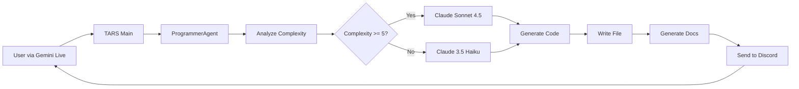

# Claude Programming Integration Guide

**Last Updated**: 2026-01-27  
**Status**: ✅ Implemented and Ready

---

## Overview

TARS's `ProgrammerAgent` now uses **Claude AI** for code generation and editing tasks, with intelligent model selection based on task complexity. This provides superior code quality and reasoning capabilities compared to the previous Gemini integration.

## Features

### 1. Intelligent Model Selection

The system automatically chooses between two Claude models based on task complexity:

- **Claude Sonnet 4.5** (`claude-sonnet-4-20250514`) - For complex tasks
- **Claude 3.5 Haiku** (`claude-3-5-haiku-20241022`) - For simple, fast tasks

### 2. Complexity Analysis

Tasks are analyzed on a 0-10 scale considering:
- **Keywords**: "refactor", "architecture", "debug", "design", "optimize" (increase complexity)
- **File Size**: Lines of code in the file
- **Scope**: Single vs. multiple files
- **Simplicity Keywords**: "comment", "typo", "rename", "format" (decrease complexity)

**Threshold**: Complexity ≥ 5 uses Sonnet 4.5, < 5 uses Haiku 3.5

### 3. Automatic Documentation

Every file creation and edit generates a markdown documentation file containing:
- **Timestamp** and file path
- **Model used** (Sonnet 4.5 or Haiku 3.5)
- **Complexity score** (0-10)
- **Logic explanation**
- **Changes made** (for edits, includes diff)
- **Test results** (if tests were run)

Documentation is saved to `.tars_docs/` in the project directory.

### 4. Discord Notifications

Documentation is automatically sent to Discord via the N8N webhook (KIPP integration), keeping you informed of all programming activities.

---

## Configuration

### Required Environment Variables

Add to your `.env` file:

```bash
# Claude API Configuration
ANTHROPIC_API_KEY=sk-ant-api03-xxxxx  # Required - Get from console.anthropic.com

# Optional: Override default models
CLAUDE_COMPLEX_MODEL=claude-sonnet-4-20250514  # Default: Sonnet 4.5
CLAUDE_FAST_MODEL=claude-3-5-haiku-20241022    # Default: Haiku 3.5

# Optional: Programming documentation settings
ENABLE_PROGRAMMING_DOCS=true          # Default: true
PROGRAMMING_DOCS_DIR=.tars_docs       # Default: .tars_docs
```

### Getting an Anthropic API Key

1. Visit [console.anthropic.com](https://console.anthropic.com)
2. Sign up or log in
3. Navigate to API Keys section
4. Create a new API key
5. Copy the key (starts with `sk-ant-`)
6. Add it to your `.env` file as `ANTHROPIC_API_KEY`

---

## Usage Examples

### 1. Creating a New File with AI

```python
# Via Gemini Live conversation:
"Create a Python file called data_processor.py that reads CSV files and calculates statistics"

# What happens:
# 1. Task analyzed → Complexity: 6/10
# 2. Claude Sonnet 4.5 selected (complex task)
# 3. Code generated
# 4. File created
# 5. Documentation generated and saved
# 6. Discord notification sent
```

### 2. Editing an Existing File

```python
# Via Gemini Live conversation:
"Edit main.py to add error handling for network requests"

# What happens:
# 1. File content read
# 2. Task analyzed → Complexity: 5/10
# 3. Claude Sonnet 4.5 selected
# 4. Changes generated with diff
# 5. File updated with backup
# 6. Documentation with before/after generated
# 7. Discord notification sent
```

### 3. Simple Edits (Fast Model)

```python
# Via Gemini Live conversation:
"Add a comment to the calculate function in utils.py"

# What happens:
# 1. Task analyzed → Complexity: 2/10
# 2. Claude 3.5 Haiku selected (simple task)
# 3. Quick edit applied
# 4. Documentation generated
# 5. Discord notification sent
```

---

## Model Selection Logic

### Complex Tasks (Sonnet 4.5) Used For:

- ✅ Multi-file refactoring
- ✅ Complex architecture changes
- ✅ Debugging across multiple files
- ✅ Algorithm design
- ✅ Performance optimization
- ✅ Files > 500 lines
- ✅ Tasks with keywords: "refactor", "architecture", "debug", "design", "optimize"

### Fast Tasks (Haiku 3.5) Used For:

- ⚡ Simple edits (< 50 lines)
- ⚡ Single file operations
- ⚡ Syntax fixes
- ⚡ Adding comments
- ⚡ Code formatting
- ⚡ Renaming variables
- ⚡ Simple feature additions

---

## Documentation Structure

### File Creation Report Example

```markdown
# File Creation Report: data_processor.py

**Operation**: File Creation
**Timestamp**: 2026-01-27 14:30:22
**File Path**: /Users/matedort/projects/analytics/data_processor.py
**Model Used**: Claude Sonnet 4.5
**Complexity Score**: 6/10

## Logic Used
Created a Python module to read CSV files and calculate basic statistics
including mean, median, and standard deviation using pandas library.

## Test Results
No tests run

---
*Generated by TARS Programming Agent*
```

### File Edit Report Example

```markdown
# File Edit Report: main.py

**Operation**: File Edit
**Timestamp**: 2026-01-27 14:35:18
**File Path**: /Users/matedort/projects/api/main.py
**Model Used**: Claude Sonnet 4.5
**Complexity Score**: 5/10

## Changes Made
--- main.py (original)
+++ main.py (modified)
@@ -45,6 +45,12 @@
 def fetch_data(url):
+    try:
         response = requests.get(url)
+        response.raise_for_status()
+        return response.json()
+    except requests.RequestException as e:
+        logger.error(f"Network error: {e}")
+        return None

## Logic Used
Added comprehensive error handling for network requests including
timeout handling and proper logging.

## Test Results
No tests run

---
*Generated by TARS Programming Agent*
```

---

## File Structure

```
TARS_PHONE_AGENT/
├── sub_agents_tars.py        # Updated with Claude integration
├── core/
│   └── config.py             # Updated with Claude config
├── requirements.txt          # Updated with anthropic package
├── .tars_docs/               # Auto-generated documentation
│   ├── create_processor_20260127_143022.md
│   ├── edit_main_20260127_143518.md
│   └── ...
└── docs/
    └── CLAUDE_PROGRAMMING_INTEGRATION.md  # This file
```

---

## New Methods in ProgrammerAgent

### Core Methods

1. **`_analyze_task_complexity()`**
   - Analyzes task complexity (0-10 scale)
   - Considers keywords, file size, scope

2. **`_should_use_complex_model()`**
   - Decides which Claude model to use
   - Returns True for Sonnet 4.5, False for Haiku 3.5

3. **`_call_claude()`**
   - Low-level Claude API wrapper
   - Handles API calls with error handling

4. **`_generate_code_with_claude()`**
   - High-level code generation method
   - Returns code + metadata (model used, complexity)

5. **`_generate_documentation()`**
   - Creates markdown documentation
   - Supports both create and edit operations

6. **`_send_docs_to_discord()`**
   - Sends documentation to Discord via N8N
   - Uses existing KIPP webhook integration

### Updated Methods

- **`_edit_file()`** - Now uses Claude instead of Gemini
- **`_create_file()`** - Enhanced to use Claude for content generation

---

## Troubleshooting

### Claude Client Not Initialized

**Error**: `"Claude client not initialized. Please set ANTHROPIC_API_KEY in your .env file."`

**Solution**: Add your Anthropic API key to `.env`:
```bash
ANTHROPIC_API_KEY=sk-ant-api03-xxxxx
```

### Discord Notifications Not Sending

**Error**: `"Documentation generated but Discord notification skipped (webhook not configured)"`

**Solution**: Ensure `N8N_WEBHOOK_URL` is set in your `.env` file.

### Model Selection Not Working as Expected

**Check**: Look at the logs - they show:
- Task complexity score
- Model selected
- Reasoning for selection

**Example Log**:
```
INFO: Task complexity analysis: 7/10 for 'refactor database layer'
INFO: Selected Claude Sonnet 4.5 (complex) for complexity 7/10
```

---

## Cost Optimization

### Model Selection Saves Money

- **Haiku 3.5**: $0.25 per 1M input tokens, $1.25 per 1M output tokens
- **Sonnet 4.5**: $3.00 per 1M input tokens, $15.00 per 1M output tokens

Simple tasks automatically use Haiku 3.5, saving ~92% on input costs!

### Typical Task Costs

- **Simple comment addition** (Haiku): ~$0.001
- **Complex refactoring** (Sonnet): ~$0.05-0.10
- **New file creation** (varies): $0.005-0.05 depending on complexity

---

## Integration with TARS

### How It Works



### Function Call Flow

1. User speaks: "Create a web scraper in Python"
2. Gemini Live processes request
3. Calls `programmer` tool with action `create`
4. ProgrammerAgent analyzes task
5. Selects appropriate Claude model
6. Generates code
7. Creates file
8. Generates documentation
9. Sends to Discord
10. Returns success message to user

---

## Best Practices

### 1. Be Specific in Requests

❌ **Vague**: "Fix the code"
✅ **Specific**: "Add input validation to the user registration function in auth.py"

### 2. Trust the Model Selection

The system automatically chooses the right model. For edge cases:
- Simple tasks that seem complex → Haiku will handle them
- Complex tasks → Sonnet ensures quality

### 3. Review Generated Documentation

Check `.tars_docs/` regularly to:
- Understand what changes were made
- Track complexity trends
- Verify model selection is working

### 4. Use Project Context

Open a project first: "Open project my-api"
Then work within it: "Create a new endpoint handler"

---

## Future Enhancements

Potential additions (not yet implemented):

- [ ] Test execution and results in documentation
- [ ] Multi-file operation support
- [ ] Custom complexity thresholds per project
- [ ] Code review and suggestions
- [ ] Integration with linters (pylint, eslint, etc.)
- [ ] Git commit message generation using Claude

---

## Support

For issues or questions:
1. Check logs in terminal where TARS is running
2. Review `.tars_docs/` for operation details
3. Verify `.env` configuration
4. Check Discord for notification delivery

---

**Status**: ✅ Fully Operational
**Version**: 1.0
**Last Tested**: 2026-01-27
