# N8N Background Tasks Setup

**Configure N8N workflows to handle TARS background programming task updates**

---

## Overview

For background programming tasks to send Discord updates and handle confirmation codes, you need to configure your **existing N8N/KIPP webhook** to:

1. **Recognize background task messages** (via `target: "discord"` field)
2. **Route to Discord** (Discord bot)
3. **Listen for confirmation replies** (Discord listener)
4. **Send confirmation codes back to TARS** (HTTP POST)

**Important**: Background task updates now route through the same `N8N_WEBHOOK_URL` that KIPP uses. No separate webhook needed!

---

## Architecture

```mermaid
flowchart LR
    TARS[TARS Background Worker] -->|POST with target=discord| KIPP[N8N KIPP Webhook]
    KIPP -->|Detect background task| Router[Route by Target]
    Router -->|Discord| DiscordMsg[Discord Message Node]
    DiscordMsg -->|Send| Discord[Discord Channel]
    
    Discord -->|User Reply| DiscordListener[N8N Discord Listener]
    DiscordListener -->|Parse Code| ExtractCode[Extract Confirmation]
    ExtractCode -->|HTTP POST| TARSConfirm[TARS /webhook/background-confirmation]
```



**Key Change**: Background tasks now send updates to the **same N8N webhook** as all other KIPP messages, but with `target: "discord"` and `source: "background_task"` fields to identify them.

---

## Workflow 1: Update Existing KIPP Webhook

**Purpose**: Modify your existing KIPP workflow to handle background task messages

### N8N Workflow Configuration

1. **Open your existing KIPP workflow** (the one with `N8N_WEBHOOK_URL`)

2. **Add IF/Switch node** after webhook trigger
   - **Name**: "Route by Target"
   - **Condition**: `{{ $json.target === "discord" && $json.source === "background_task" }}`
   - **Route 1 (TRUE)**: To Discord formatting
   - **Route 2 (FALSE)**: To existing KIPP logic

3. **Add Function node** on TRUE branch (format message)
   - **Name**: "Format Discord Message"
   - **Code**:
   ```javascript
   const data = $input.item.json;
   const taskId = data.task_id;
   const type = data.type;
   const message = data.message;
   const command = data.command;
   const phase = data.phase;
   
   // Format based on message type
   let discordMessage = "";
   
   if (type === 'task_started') {
     discordMessage = `🚀 **Background Task Started**\n\n` +
                     `**Task ID:** ${taskId}\n` +
                     `**Goal:** ${data.goal}\n` +
                     `**Project:** ${data.project}\n\n` +
                     `Updates will be posted here.`;
   }
   else if (type === 'confirmation_request') {
     discordMessage = `⚠️ **Task #${taskId} Needs Confirmation**\n\n` +
                     `**Command:** \`${command}\`\n` +
                     `**Reason:** ${data.reason}\n\n` +
                     `**Reply with your confirmation code to proceed.**`;
   }
   else if (type === 'phase_complete') {
     const phaseEmoji = {
       'started': '🚀',
       'planning': '📋',
       'coding': '✏️',
       'testing': '🧪',
       'complete': '🎉',
       'error': '❌',
       'timeout': '⏱️'
     };
     const emoji = phaseEmoji[phase] || '▶️';
     discordMessage = `${emoji} **${message}**`;
   }
   else if (type === 'progress') {
     discordMessage = message;
     if (command) {
       discordMessage += `\n\`\`\`bash\n${command}\n\`\`\``;
     }
   }
   else {
     discordMessage = `**Task #${taskId}:** ${message}`;
   }
   
   return {
     message: discordMessage,
     task_id: taskId,
     requires_confirmation: data.awaiting_confirmation || false
   };
   ```

4. **Add Discord node** (send message)
   - **Resource**: Your Discord bot
   - **Operation**: Send Message
   - **Channel ID**: Your TARS updates channel
   - **Message Text**: `{{ $json.message }}`

5. **Save and activate workflow**

6. **Verify N8N webhook** is already configured in TARS `.env`:
   ```env
   N8N_WEBHOOK_URL=https://n8n.srv1283735.hstgr.cloud/webhook-test/your-webhook-id
   # Background tasks now use the same webhook - no separate URL needed!
   ```

---

## Workflow 2: Discord Confirmation Code Handler

**Purpose**: Listen for user confirmation codes in Discord and send to TARS

### N8N Workflow Configuration

1. **Create new workflow**: "TARS Confirmation Handler"

2. **Add Discord Trigger node**
   - **Event**: Message Created
   - **Channel ID**: Your TARS updates channel
   - **Ignore Bots**: Yes (don't react to TARS bot's own messages)

3. **Add IF node** (check if message is a confirmation code)
   - **Name**: "Is Confirmation Code?"
   - **Conditions**:
     - Message content matches regex: `^\d{4}$` (4-digit code)
     - OR Message content contains: "code" + numbers

4. **Add Function node** (extract task ID from recent messages)
   - **Name**: "Find Pending Task"
   - **Code**:
   ```javascript
   // This node needs access to recent channel messages
   // to find the task ID that's awaiting confirmation
   
   const userMessage = $input.item.json.content;
   const code = userMessage.match(/\d{4}/)[0];  // Extract 4-digit code
   
   // You'll need to query recent messages to find the task_id
   // that's awaiting confirmation (look for "Task #xyz needs confirmation")
   // This is a simplified version - you may need Message History node
   
   return {
     confirmation_code: code,
     task_id: $env.LAST_TASK_ID  // Set this from previous workflow
   };
   ```
   
   **Alternative simpler approach**: Store the task_id in N8N's internal database when confirmation is requested:
   
   **In Workflow 1**, add a "Set" node after sending confirmation request:
   ```javascript
   // Store the task_id when confirmation requested
   $('KV Store').set('awaiting_confirmation_task', data.task_id);
   ```
   
   **In Workflow 2**, retrieve it:
   ```javascript
   const taskId = $('KV Store').get('awaiting_confirmation_task');
   const code = $input.item.json.content.match(/\d{4}/)[0];
   
   return {
     task_id: taskId,
     confirmation_code: code
   };
   ```

5. **Add HTTP Request node** (send to TARS)
   - **Method**: POST
   - **URL**: `http://localhost:5002/webhook/background-confirmation` (or your TARS URL)
   - **Body**:
   ```json
   {
     "task_id": "{{ $json.task_id }}",
     "confirmation_code": "{{ $json.confirmation_code }}"
   }
   ```

6. **Add Discord node** (confirm receipt)
   - **Operation**: Send Message
   - **Channel ID**: Same channel
   - **Message**: `✅ Confirmation code received! Task #{{ $json.task_id }} will continue.`

7. **Save and activate workflow**

---

## Simplified Setup (Recommended)

If the full workflow seems complex, use this **simpler approach**:

### Single Workflow with Dual Trigger

1. **Webhook Trigger** (for task updates) → Discord Send
2. **Discord Trigger** (for confirmation codes) → Manual task_id input

**How it works**:
- When TARS needs confirmation, it sends task_id in the Discord message
- User replies: `Task a7f3: 6283`
- N8N extracts both task_id and code from user's message
- N8N POSTs to TARS

**Regex for parsing user reply**:
```javascript
const match = userMessage.match(/task\s+(\w+):?\s*(\d{4})/i);
if (match) {
  return {
    task_id: match[1],
    confirmation_code: match[2]
  };
}
```

---

## Testing the Setup

### Test Task Updates

1. Start TARS and worker
2. Start a background task (voice): "Build a simple hello world script"
3. Check Discord - you should see:
   ```
   🚀 Background Task Started
   Task ID: abc123
   Goal: Build a simple hello world script
   Project: /Users/matedort/test_project
   ```

### Test Confirmation Flow

1. Manually trigger a confirmation request:
   ```bash
   curl -X POST http://localhost:5002/webhook/background-confirmation \
     -H "Content-Type: application/json" \
     -d '{"task_id": "test123", "type": "confirmation_request", "command": "rm test.txt", "reason": "delete files", "message": "Test confirmation request"}'
   ```

2. Check Discord - you should see the confirmation request

3. Reply in Discord with your confirmation code: "6283"

4. Check TARS logs - you should see: "Received Discord confirmation code for task test123"

---

## Payload Reference

### TARS → N8N (Task Updates)

**Endpoint**: `POST https://n8n.srv1283735.hstgr.cloud/webhook/discord-updates`

**Payload structure**:
```json
{
  "task_id": "abc123",
  "type": "task_started | progress | phase_complete | confirmation_request | task_complete | error",
  "message": "Human-readable message",
  "timestamp": "2026-01-27T16:10:00.000Z",
  
  // Optional fields
  "command": "pytest test.py",           // For progress messages with commands
  "phase": "testing",                    // For phase_complete messages
  "goal": "Build calculator",            // For task_started
  "project": "/Users/matedort/calc",     // For task_started
  "awaiting_confirmation": true,         // For confirmation_request
  "reason": "delete files"               // For confirmation_request
}
```

### N8N → TARS (Confirmation Codes)

**Endpoint**: `POST http://localhost:5002/webhook/background-confirmation`

**Payload structure**:
```json
{
  "task_id": "abc123",
  "confirmation_code": "6283"
}
```

**Response**:
```json
{
  "status": "ok",
  "message": "Confirmation received"
}
```

---

## Discord Channel Setup

### Recommended Channel Structure

Create a dedicated Discord server or channel for TARS:

```
📱 TARS Server
  ├── 📢 #general (regular conversations)
  ├── 🔧 #background-tasks (task updates)
  └── ⚠️ #confirmations (confirmation requests - optional, can use same channel)
```

Or simple setup:
```
📱 Your Server
  └── 🤖 #tars (all TARS messages)
```

### Discord Bot Permissions

Your Discord bot needs:
- `Send Messages`
- `Read Message History` (for finding task_id in recent messages)
- `Embed Links` (for formatted messages)

---

## Environment Variables Summary

Add to TARS `.env`:

```env
# Discord Updates Webhook
DISCORD_UPDATES_WEBHOOK=https://n8n.srv1283735.hstgr.cloud/webhook/discord-updates

# Background Task Settings
MAX_TASK_RUNTIME_MINUTES=15
ENABLE_DETAILED_UPDATES=true

# Redis Configuration
REDIS_HOST=localhost
REDIS_PORT=6379
REDIS_DB=0
```

---

## Troubleshooting

### Messages Not Appearing in Discord

**Check**:
1. N8N workflow is **active** (toggle in top-right)
2. Discord bot has **correct permissions**
3. Channel ID is **correct**
4. Webhook URL in TARS `.env` is **correct**

**Debug**:
```bash
# Test the webhook manually
curl -X POST https://n8n.srv1283735.hstgr.cloud/webhook/discord-updates \
  -H "Content-Type: application/json" \
  -d '{
    "task_id": "test",
    "type": "progress",
    "message": "Test message from curl"
  }'
```

### Confirmation Codes Not Working

**Check**:
1. N8N Discord trigger is **active**
2. N8N can **reach TARS webhook** (check firewall/ngrok)
3. User message format is **correct** (just the 4-digit code)
4. Task ID is being **correctly extracted**

**Debug**:
```bash
# Test TARS confirmation endpoint
curl -X POST http://localhost:5002/webhook/background-confirmation \
  -H "Content-Type: application/json" \
  -d '{"task_id": "abc123", "confirmation_code": "6283"}'
```

### Workflow Execution Errors

**Check N8N logs**:
1. Open workflow in N8N
2. Click "Executions" in left sidebar
3. Find failed executions
4. Click to see error details

**Common issues**:
- Discord bot credentials invalid
- HTTP Request timeout (increase timeout in node settings)
- JSON parsing error (check payload format)

---

## Advanced: Custom Message Formatting

### Rich Embeds for Discord

Instead of plain text, use Discord embeds for prettier messages:

**In Function node**:
```javascript
const embed = {
  title: `Background Task #${taskId}`,
  description: message,
  color: type === 'error' ? 0xFF0000 : type === 'complete' ? 0x00FF00 : 0x0099FF,
  fields: [
    { name: 'Status', value: phase || 'In Progress', inline: true },
    { name: 'Type', value: type, inline: true }
  ],
  timestamp: new Date().toISOString()
};

if (command) {
  embed.fields.push({
    name: 'Command',
    value: `\`${command}\``,
    inline: false
  });
}

return { embeds: [embed] };
```

**In Discord node**:
- Use "Send Embed" instead of "Send Message"
- Pass the embed object

### Thread-Based Organization

For each background task, create a Discord thread:

1. When task starts, create thread: "Task #abc123"
2. All updates for that task go in the thread
3. Keeps main channel clean

**N8N Discord node**:
- Operation: "Create Thread"
- Channel ID: Parent channel
- Thread Name: `Task #{{ $json.task_id }}`
- Store thread ID for subsequent messages

---

## Quick Start Template

### Minimal N8N Workflow (Copy & Paste)

```json
{
  "name": "TARS Background Tasks - Simple",
  "nodes": [
    {
      "name": "Webhook",
      "type": "n8n-nodes-base.webhook",
      "parameters": {
        "path": "discord-updates",
        "responseMode": "onReceived",
        "responseData": "{ \"status\": \"ok\" }"
      }
    },
    {
      "name": "Discord",
      "type": "n8n-nodes-base.discord",
      "parameters": {
        "resource": "message",
        "operation": "send",
        "channelId": "YOUR_CHANNEL_ID",
        "content": "={{ $json.message }}"
      }
    }
  ],
  "connections": {
    "Webhook": {
      "main": [[{ "node": "Discord", "type": "main", "index": 0 }]]
    }
  }
}
```

**Setup**:
1. Import this JSON in N8N
2. Replace `YOUR_CHANNEL_ID` with your Discord channel
3. Configure Discord bot credentials
4. Activate workflow
5. Copy webhook URL to TARS `.env`

---

## Example Messages

### Task Started

**From TARS to N8N**:
```json
{
  "task_id": "a7f3b2c1",
  "type": "task_started",
  "goal": "Create a calculator app with tests",
  "project": "/Users/matedort/calculator",
  "message": "🚀 Started background task #a7f3b2c1: Create a calculator app with tests",
  "timestamp": "2026-01-27T16:00:00.000Z"
}
```

**N8N to Discord**:
```
🚀 Background Task Started

Task ID: a7f3b2c1
Goal: Create a calculator app with tests
Project: /Users/matedort/calculator

Updates will be posted here.
```

### Progress Update

**From TARS**:
```json
{
  "task_id": "a7f3b2c1",
  "type": "progress",
  "message": "✏️ Editing calculator.py",
  "timestamp": "2026-01-27T16:01:30.000Z"
}
```

**To Discord**:
```
✏️ Editing calculator.py
```

### Command Execution

**From TARS**:
```json
{
  "task_id": "a7f3b2c1",
  "type": "progress",
  "message": "⚙️ Executing: `pytest test_calculator.py`\nReason: run tests",
  "command": "pytest test_calculator.py",
  "timestamp": "2026-01-27T16:03:00.000Z"
}
```

**To Discord**:
```
⚙️ Executing: `pytest test_calculator.py`
Reason: run tests
```bash
pytest test_calculator.py
```
```

### Confirmation Request

**From TARS**:
```json
{
  "task_id": "a7f3b2c1",
  "type": "confirmation_request",
  "command": "rm old_backup.py",
  "reason": "delete files",
  "message": "⚠️ Background Task #a7f3b2c1 Needs Confirmation\n\nCommand: `rm old_backup.py`\nReason: delete files\n\nReply with your confirmation code to proceed.",
  "awaiting_confirmation": true,
  "timestamp": "2026-01-27T16:05:00.000Z"
}
```

**To Discord**:
```
⚠️ Background Task #a7f3b2c1 Needs Confirmation

Command: `rm old_backup.py`
Reason: delete files

Reply with your confirmation code to proceed.
```

**User replies in Discord**: `6283`

**N8N processes**:
1. Detects 4-digit number in message
2. Looks up most recent task awaiting confirmation → `a7f3b2c1`
3. POSTs to TARS:
   ```json
   {
     "task_id": "a7f3b2c1",
     "confirmation_code": "6283"
   }
   ```

**TARS stores in Redis** → Worker continues

### Task Complete

**From TARS**:
```json
{
  "task_id": "a7f3b2c1",
  "type": "phase_complete",
  "phase": "complete",
  "message": "🎉 Task complete!\nAll tests passed, code formatted and ready.",
  "timestamp": "2026-01-27T16:10:00.000Z"
}
```

**To Discord**:
```
🎉 Task complete!
All tests passed, code formatted and ready.
```

---

## Security Considerations

### Webhook Authentication

Add basic auth to your N8N webhook:

**In N8N Webhook node**:
- Authentication: Header Auth
- Header Name: `X-TARS-Secret`
- Header Value: `your-secret-key`

**In TARS** (`core/background_worker.py`):
```python
headers = {
    'X-TARS-Secret': 'your-secret-key'
}

async with session.post(webhook_url, json=payload, headers=headers) as response:
    ...
```

### Confirmation Code Privacy

- Don't log confirmation codes in N8N
- Use Discord DMs instead of public channels
- Rotate confirmation codes periodically

### Rate Limiting

Add rate limiting to prevent Discord spam:

**In N8N**:
- Add "Throttle" node between webhook and Discord
- Max: 10 messages per minute

---

## Next Steps

1. Set up the workflows in N8N
2. Test with a simple task: "Create a hello world script"
3. Verify Discord messages appear
4. Test confirmation flow with a destructive command
5. Read [BACKGROUND_PROGRAMMING.md](BACKGROUND_PROGRAMMING.md) for usage guide

---

## Support

If you encounter issues:
1. Check N8N execution logs for errors
2. Check TARS logs for webhook send failures
3. Verify Discord bot permissions
4. Test webhooks with `curl` commands above

For N8N workflow examples and templates, see the N8N community forum or contact the TARS maintainer.
